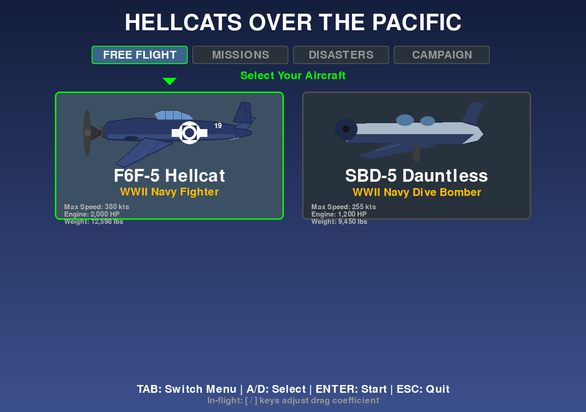
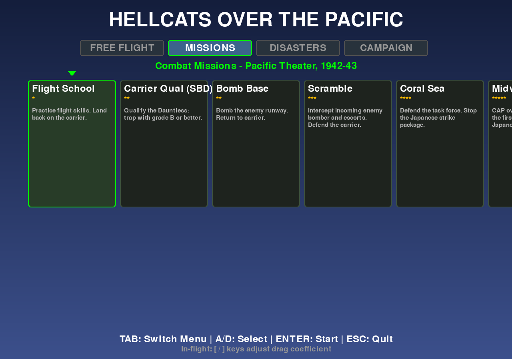
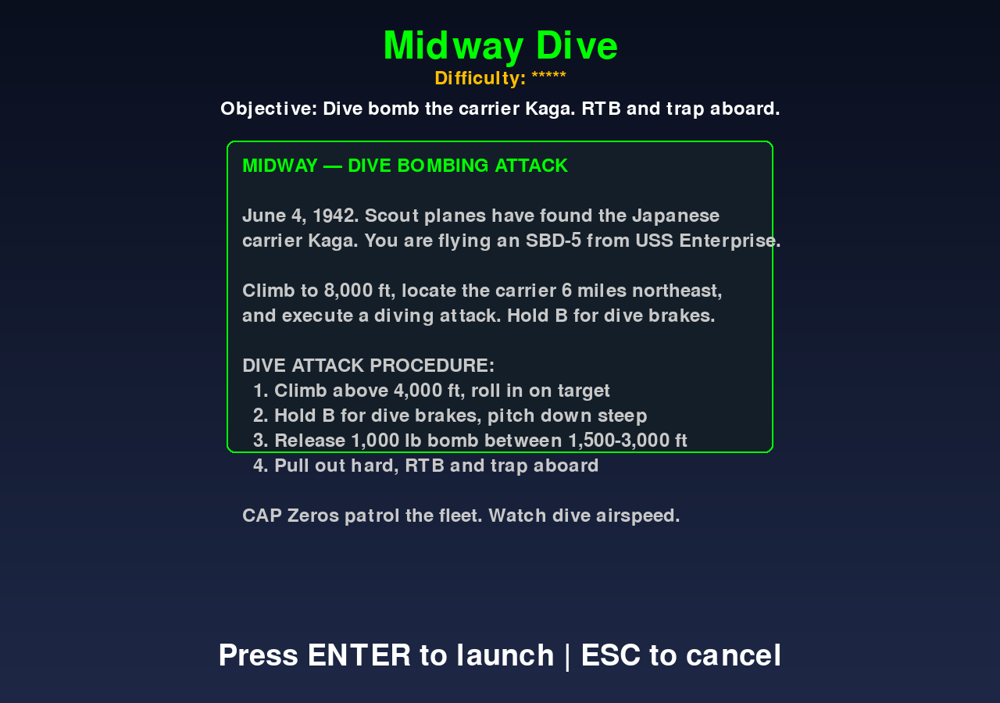
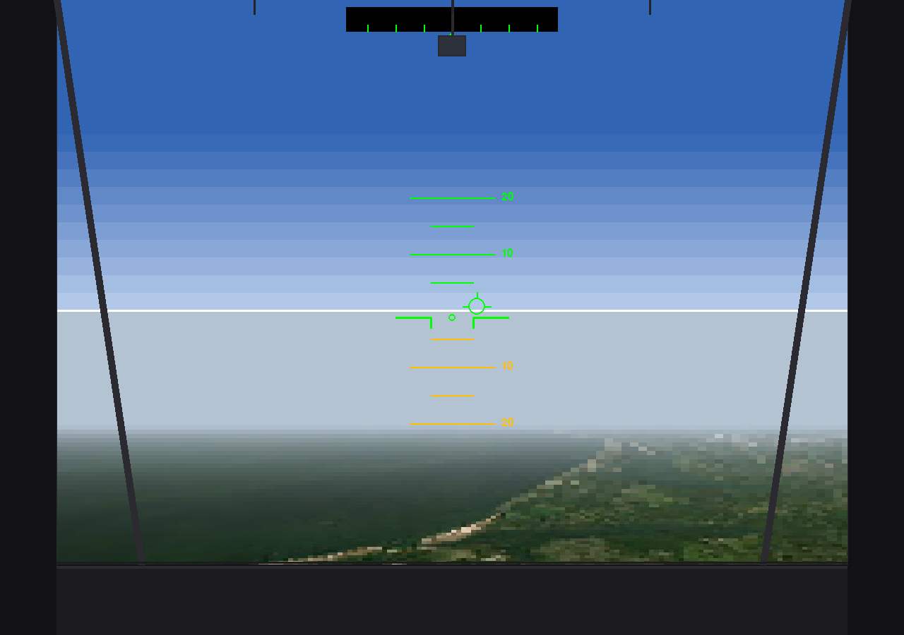
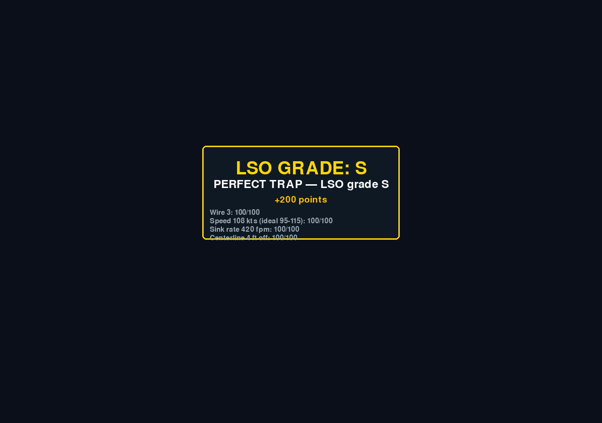

# Hellcats Over the Pacific - Enhanced Edition

A WWII Pygame flight simulator and historical disaster recreation, inspired by the classic 1991 *Hellcats Over the Pacific*. Fly Pacific Theater combat missions, campaign sorties, and forensic simulations of historic aviation accidents — all in one physics engine.



## Features

### Flyable Aircraft
- **F6F-5 Hellcat** — US Navy fleet defender; 6× .50 cal, HVAR rockets, bombs, torpedo
- **F4U-1D Corsair** — faster, higher VNE dive limit; 6× .50 cal, 8× HVAR, 2× 1,000 lb bombs
- **SBD-5 Dauntless** — carrier dive bomber; hold **B** for dive brakes, steep dive, release 1,500–3,000 ft AGL
- **Boeing 747-200** — airliner physics for free flight and disaster scenarios
- **Boeing 737-300** — narrow-body jet (Helios 522 scenario)
- **Airbus A330-200** — wide-body jet with unreliable-airspeed simulation (AF447)

### Enemy Aircraft
- **A6M Zero** — superior turn rate, historical AI dogfighting
- **G4M Betty** — bomber targets in scramble and strike missions

### Combat Missions (12)
1. **Flight School** — practice takeoff, flight, carrier landing
2. **Carrier Qual (SBD)** — graded trap; earn LSO grade B or better
3. **Bomb Base** — strike an enemy airfield and RTB
4. **Scramble** — intercept inbound bomber strike
5. **Coral Sea** — defend the task force (May 1942)
6. **Midway CAP** — break the first wave over Midway (June 1942)
7. **Midway Dive** — SBD dive bomb on the carrier Kaga (release window 1,500–3,000 ft), then RTB (June 1942)
8. **Divine Wind** — kamikaze defense
9. **Flat Top** — sink the enemy carrier
10. **Bomber Escort** — protect B-17s to the target
11. **Torpedo Run** — low-level convoy attack
12. **Night Strike** — fuel depot raid under searchlights

### Carrier Landing Grades
Every trap is scored by the LSO: **S** (perfect), **A**, **B** (pass), **C**, **F** (bolter). Scoring factors: wire number, approach speed, sink rate, centerline, gear. The SBD uses a slower trap window (95–115 kts). Grades award bonus points and appear in your pilot dossier (**P**).

### Dive Bombing (SBD)
Hold **B** for dive brakes and enter a steep dive on the target. The HUD shows dive state (cruise → diving → pullout) and release altitude. Drop your 1,000 lb bomb between **1,500–3,000 ft** AGL for a valid hit on **Midway Dive**.

### Audio
Procedural background music: menu theme, combat tension, disaster drone. Per-airframe engine timbres (radial fighters, SBD, jet narrow/wide). Stings play on perfect traps and mission results. No external audio files required.

| Key | Action |
|-----|--------|
| N | Toggle background music |
| 9 / 0 | Music volume down / up |
| 7 / 8 | SFX volume down / up |

### Disaster Recreations (6)
- **TWA Flight 800** (1996) — center fuel tank explosion
- **Pan Am Flight 103** (1988) — Lockerbie bomb detonation
- **JAL Flight 123** (1985) — hydraulic failure; engines still work
- **Helios Flight 522** (2005) — Boeing 737; hypoxia — descend below 10,000 ft to survive
- **Air France Flight 447** (2009) — Airbus A330; pitot icing and unreliable airspeed
- **Eastern Air Lines 401** (1972) — autopilot disconnect; watch the altimeter

### Other Modes
- **Campaign** — linear mission progression with persistent aircraft state
- **Pilot Dossier** — rank, score, and mission awards (**P** in flight)
- **Satellite maps** — pick any area on startup (Pearl Harbor, Midway, etc.)
- **Deterministic replay** — HOTP RNG reconstructed from the 1991 game binary

## Installation

1. Python 3.8+
2. Install dependencies:

```bash
pip install -r requirements.txt
```

## Screenshots

| Menu | Missions | Midway Dive briefing |
|------|----------|----------------------|
|  |  |  |

| Cockpit (Hellcat) | LSO grade S |
|-------------------|-------------|
|  |  |

Regenerate with:

```bash
python scripts/capture_screenshots.py
```

## Running

```bash
python hellcat_sim.py
```

Or on Windows:

```bat
run_simulator.bat
```

Module entry point:

```bash
python -m hellcats
```

## Controls

### Flight
| Key | Action |
|-----|--------|
| W/S | Pitch up/down |
| A/D | Roll left/right |
| Q/E | Rudder left/right |
| Shift/Ctrl | Throttle up/down |
| F | Flaps |
| G | Gear |
| B | Dive brakes (SBD only) |
| V | Cycle camera (Overhead / Cockpit / Chase) |
| +/- or ]/[ | Drag coefficient |
| R | Reset |
| M | Return to menu |
| N | Toggle music |
| 7/8 | SFX volume down/up |
| 9/0 | Music volume down/up |
| ESC | Menu / quit |

### Combat (Hellcat family)
| Key | Action |
|-----|--------|
| 1 | Machine guns |
| 2 | HVAR rockets |
| 3 | 500 lb bomb |
| 4 | Mk 13 torpedo |
| Space | Fire selected weapon |
| L | Drop flare (night missions) |

### Menu
| Key | Action |
|-----|--------|
| Tab | Switch mode (Free Flight / Missions / Disasters / Campaign) |
| A/D or ←/→ | Select item |
| Enter | Launch |

## Project Structure

```
hellcat_sim.py          # Entry point
hellcats/
  bootstrap.py          # Pygame init, fonts, map loading
  hotp.py               # Authentic 1991 RNG & aero tables
  aircraft.py           # Flight models
  carrier_ops.py        # LSO landing grades
  missions.py           # Combat missions & campaign
  disasters.py          # Historical accident scenarios
  dive_bombing.py       # SBD dive-bomb state machine & HUD
  sound.py              # Procedural SFX and music
  weapons.py / targets.py / friendly.py
  render_game.py        # Cockpit, chase, HUD, instruments
  game.py               # Main loop
```

## Technical Notes

- **Pygame** for rendering and input
- **Custom 3D projection** for enemy aircraft
- **ESRI World Imagery** tiles downloaded on demand (cached in `~/.hellcat_tile_cache/`)
- Monolithic source was split into the `hellcats/` package in 2026; `hellcat_sim.py` remains the launcher

## Historical Accuracy

The simulator emphasizes authentic flight characteristics, Pacific Theater scenarios, and early-1990s flat-shaded presentation. Disaster scenarios are educational simulations — not entertainment glorifying tragedy — built to illustrate failure modes and emergency response windows.

---

*"The Hellcat was the fighter that won the Pacific war in the air."* — Naval Aviation Museum